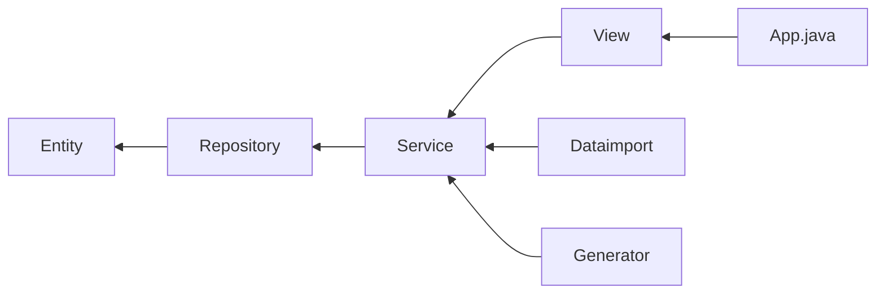

# Binar BEJ Challenge 3


Independent Study batch 5 Binar Academy - Backend Java
Challenge 3 assignment - BinarFud

## Disclaimer
This is not a real-world project; this project is only for educational purposes.

## 📌 Features

- Shows menu with price
- Order menu
- Add quantity amount
- Multiple order menu
- Shows order detail
- Make receipt

## 📥 Getting Started

### Prerequisites

- Java (version 8 or higher)
- Maven
- Git

### Installation

Clone this repository first:
```git
git clone git@github.com:solahkay/binar-bej-challenge.git
```

change the directory to the root of the project:
```git
cd binar-bej-challenge
```

create branch `challenge_3`:
```git
git branch challenge_3
```

switch to branch `challenge_3`:
```git
git switch challenge_3
```

don't forget to pull the code in remote repository:
```git
git pull origin challenge_3
```

and then the project are ready to use!

## 🔧 Usage

[](https://postimg.cc/v18Czpbw)

For running this project, use command:
```maven
mvn exec:java
```

OR

you can build this project with `maven`:
```maven
mvn clean package
```

and then run the `.jar` file in *target* folder:
```
java -jar target/binar-bej-challenge-3.0-SNAPSHOT.jar
```

## 🔗 Workflow



**CSV format**
```
[menuName];[price]

// replace without bracket
```

Example:
```
Nasi Goreng;15000
Mie Goreng;13000
Es Teh Manis;3000
Nasi + Ayam;18000
Es Campur;5000
```

The dataimport class will import the menu from `menu.csv` and the service class will validate whether the menu already exists with the same name. If true, then skip adding.

The `receipt.txt` file is created in the root project or the folder where you run the Java `.jar` file after successfully placing the order.

```
==========================
BinarFud
==========================

Terima kasih sudah memesan
di BinarFud

Di bawah ini adalah pesanan anda

Nasi Goreng       21      315.000
Nasi + Ayam        2      36.000
Es Teh Manis      51      153.000
Es Campur          1      5.000
------------------------------------+
Total             75      509.000

Pembayaran : BinarCash

==========================
Simpan struk ini sebagai
bukti pembayaran
==========================
```
